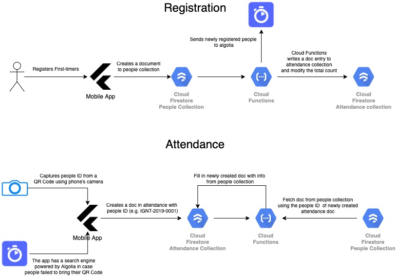

# About
Ignite QR Attendance Mobile App is used to track attendance efficiently and accurately using QR code for our youth service in our church which is called Ignite. I developed this app in my free time as a volunteer.

# Features
- Mobile app is light-weight since Cloud Functions is doing all the heavy lifting.
- Cloud-based app and can use multiple devices simultaneously.
- Native app on both iOS and Android. Thanks to Flutter!
- Uses mobile phone's camera for QR scanning.

# Technology Used
### Flutter/Dart
Flutter is a mobile UI toolkit for fast mobile development with native performance on both iOS and Android. I've used a QR scanner package for scanning using the phone's camera.

### Firestore
Firestore is a NoSql database I use for app's backend. It stores the attendee's info and attendance for each event.

### Algolia
Algolia is a search engine added in the app in case the attendees failed to bring their QR code ID.

### Google Cloud Functions
- written in Go.
- Responsible in filling the attendance document with the info from people's collection. 
- Sending newly created data in people collection to algolia.
- Counts the total attendance, church members and non-members(VIP) first timers.

# Diagram

# Screenshots
I'm not very good at design so the app's UI is very basic :)

